<!--
  Tim Jespers — GitHub Profile README
  Style: bold + branded + rich · Tone: visionary, grounded
-->

<!-- ░░░ ANIMATED HEADER ░░░
     The rotating lines below are URL-encoded in the `lines=` query param.
     In plain text, the banner cycles through:
       1. Tim Jespers
       2. Platform Engineer, ~10 years in production
       3. Designing systems that run on AI
       4. Agents · Context Engineering · SDD
       5. GCP · Kubernetes · GitOps · IaC
     To edit a line: change the text, then URL-encode it
     (space → +, & → %26, · → %C2%B7, comma → %2C).
-->

  <em>I design systems that quietly scale — and I'm now teaching them to think.</em>

  
  

---

## 👋 Hey, I'm Tim

I'm a **platform engineer** with ~10 years in production, now designing systems that run on **AI** — agents, context engineering, and Spec-Driven Development. Based in the Netherlands, I've spent that decade helping build **[Shiftbase](https://www.shiftbase.com)** into one of Europe's leading workforce-management platforms — trusted by **8,000+ businesses** scheduling **250,000+ employees every day.**

I joined as the first employee and grew with it, wearing most of the hats an engineering org needs along the way — **backend developer, system architect, team lead, platform engineer, and even security officer.** I helped **design and scale both the application & platform architecture**, architected the **Google Cloud** foundation it runs on, and moved the team onto **Kubernetes, GitOps and Infrastructure-as-Code** — all whilst keeping the whole thing secure and compliant as it grew across European markets.

Lately I've been aiming that same systems thinking at **AI**: context engineering, agentic workflows, skill design & **Spec-Driven Development**. The tools are new, the discipline isn't. Specs, guardrails and feedback loops are what turn a clever demo into something you can actually put in front of users. Most AI demos break in production; I build the ones that don't.

> **Visionary, but grounded** — I'll chase the big idea, then ship the boring version that survives Monday morning.

---

## 🧭 How I think about my work

<table>
<tr>
<td width="50%" valign="top">

### 🧱 Platforms are products
Internal tooling, golden paths and pipelines deserve the same care as anything customer-facing — they decide how fast everyone else can move.

</td>
<td width="50%" valign="top">

### 🤫 Boring infrastructure is a feature
The best platform work is invisible: things deploy, scale, and recover without anyone having to think about it.

</td>
</tr>
<tr>
<td width="50%" valign="top">

### 🤝 Architecture is a team sport
Ten years in one codebase taught me the durable wins are decisions a whole team can understand, own, and build on after I've moved on.

</td>
<td width="50%" valign="top">

### 🤖 AI changes the altitude, not the discipline
Agents and context engineering are powerful — but they still need specs, guardrails, and someone who's shipped real systems before.

</td>
</tr>
</table>

---

## 🗺️ My landscape

<!--
  This is a custom SVG generated from techstack.yaml.
  To change your stack: edit techstack.yaml, then run `python3 scripts/gen-stack.py`.
-->
<picture>
  <source media="(prefers-color-scheme: dark)"  srcset="./assets/stack-dark.svg">
  <source media="(prefers-color-scheme: light)" srcset="./assets/stack-light.svg">
  
</picture>

---

## 🚀 Current focus

**[`claude-skills`](https://github.com/tjespers/claude-skills)** — my main playground right now.

A growing toolkit of reusable **skills for Claude Code**: the agent workflows, prompts and guardrails I use daily, packaged so they're repeatable instead of one-off. It's where my platform habits (composability, conventions, "make the right thing the easy thing") meet AI tooling.

If you only click one link on this page, make it this one.

Plenty more lives in private IaC & platform repos — happy to talk through it.

---

## 📊 By the numbers

<!--
  Custom stats card generated from the GitHub API (no flaky third-party services).
  Refresh the numbers: run `python3 scripts/gen-stats.py` (uses `gh auth token`).
-->
<picture>
  <source media="(prefers-color-scheme: dark)"  srcset="./assets/stats-dark.svg">
  <source media="(prefers-color-scheme: light)" srcset="./assets/stats-light.svg">
  
</picture>

<!-- Contribution snake — rendered by the workflow in .github/workflows/snake.yml -->
<picture>
  <source media="(prefers-color-scheme: dark)" srcset="https://raw.githubusercontent.com/tjespers/tjespers/output/github-contribution-grid-snake-dark.svg" />
  <source media="(prefers-color-scheme: light)" srcset="https://raw.githubusercontent.com/tjespers/tjespers/output/github-contribution-grid-snake.svg" />
  
</picture>

---

## 💬 Say hi

Always happy to talk shop — platform & cloud architecture, GitOps/IaC, scaling engineering teams, or building AI-native workflows that hold up in production. If any of that is on your mind, my inbox is open.

  
  
  
  

  ⚡ Building boring infrastructure so the interesting things can happen.

